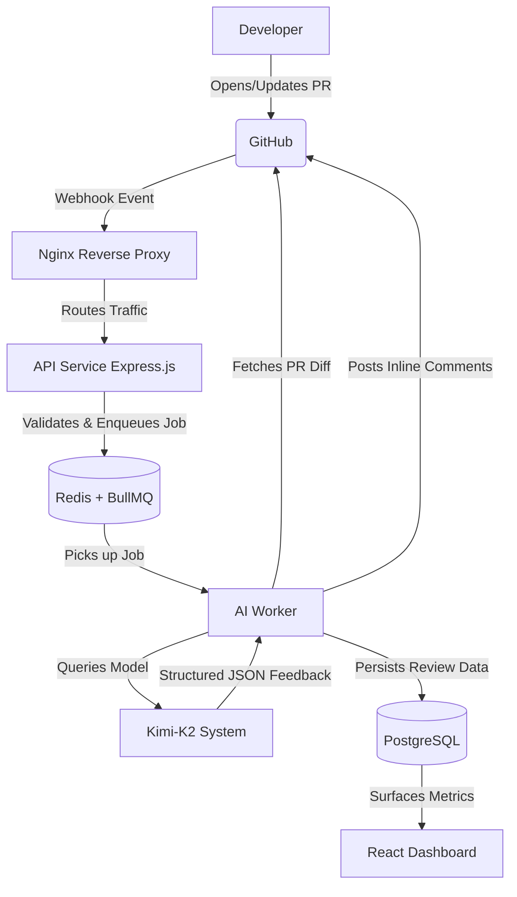

# 🤖 AI Code Review Bot

## 📖 Introduction

An automated, AI-powered GitHub App designed to seamlessly integrate into the software development lifecycle (SDLC) as an intelligent code quality gatekeeper. It reviews pull requests using **Kimi-K2**, analyzing code diffs, flagging bugs, suggesting improvements, and posting inline comments. Designed with a strong DevOps focus, this system streamlines continuous integration by providing immediate, automated feedback before human review begins.

## 🏗️ Architecture

The architecture is container-first and optimized for scalable deployment, observability, and automated CI/CD pipelines.

### Infrastructure & Deployment

- **Containerization**: The entire ecosystem (API, Web Dashboard, PostgreSQL, Redis, and message workers) is containerized using **Docker** and orchestrated natively via **Docker Compose**.
- **Hosting Layer**: Deployed on an **Azure Virtual Machine** running Linux.
- **Reverse Proxy & Traffic Routing**: **Nginx** handles incoming web traffic, SSL termination, and securely routes API requests while serving the frontend dashboard.
- **Continuous Integration & Deployment (CI/CD)**: Fully automated deployment pipeline driven by **GitHub Actions**. Code merges to the main branch trigger tests, container image builds, and automated rolling deployments to the Azure VM environment.

### Application Flow

1. **Trigger**: Developer opens or updates a Pull Request.
2. **Event Ingestion**: GitHub fires a webhook event. Nginx securely routes this traffic to the internal Express backend.
3. **Queueing & Async Processing**: The payload signature is validated, and the review task is offloaded to a **Redis**-backed **BullMQ** queue for asynchronous, resilient processing.
4. **AI Worker**: A scalable background worker picks up the job, fetches the PR diff via the GitHub API, parses unified diffs into context chunks, and queries the **Kimi-K2** model.
5. **Feedback Loop**: The worker receives structured JSON feedback and leverages the GitHub API to post inline review comments directly on the PR.
6. **Observability**: Review data, metrics, and severity stats are persisted in **PostgreSQL** and surfaced via the React dashboard for monitoring.

## 🛠️ Tech Stack

Optimized for high-performance execution, reliable containerization, and automated deployments.

### DevOps & Infrastructure

- **Cloud Provider**: Azure (Virtual Machines)
- **Containerization**: Docker, Docker Compose
- **Web Server / Proxy**: Nginx
- **CI/CD**: GitHub Actions

### Backend Platform

- **Runtime Environment**: Bun.js
- **Framework**: Express.js + TypeScript
- **Database**: PostgreSQL (Managed via Drizzle ORM)
- **Message Broker & Queue**: Redis + BullMQ

### AI & External Integrations

- **AI Model**: Moonshot Kimi-K2
- **Source Control & Auth**: GitHub App JWT, GitHub API Webhooks

### Frontend Observability Dashboard

- **Framework**: React, Vite
- **Styling**: TailwindCSS
